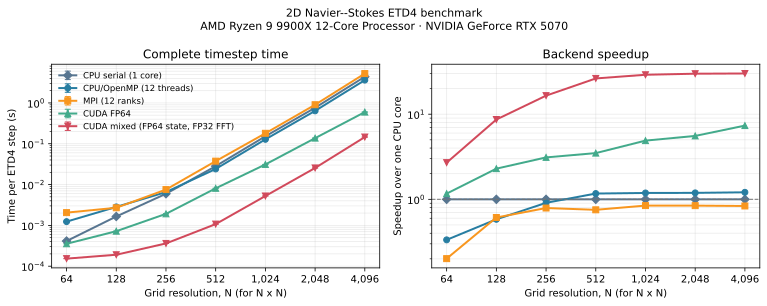

# 2D Navier–Stokes pseudo-spectral solver

A C++20 solver for the doubly periodic two-dimensional vorticity equation. It
uses a dealiased pseudo-spectral method, supports deterministic and stochastic
forcing, and writes restartable simulations with CSV diagnostics.

Current release: `v0.4.0` (2026-10-08).

Five executables share the same model, parameter format, integration methods,
and output format:

| Executable | Backend | Use case |
| --- | --- | --- |
| `navier_stokes_cpu_serial` | Serial FFTW | Single-core reference and benchmarking |
| `navier_stokes_cpu` | FFTW, with optional OpenMP | Standard shared-memory runs |
| `navier_stokes_mpi` | FFTW-MPI, with optional OpenMP | Distributed-memory runs |
| `navier_stokes_cuda` | FP64 CUDA and cuFFT | Full-double NVIDIA GPU runs |
| `navier_stokes_cuda_mixed` | FP64 state/integration, FP32 FFT path | Faster NVIDIA GPU runs when mixed precision is acceptable |

When HDF5 is available, `ns2d_hdf5_export` converts compressed vorticity
snapshots back to solver text fields or directly plottable gnuplot tables.

The current solver is self-contained; the original source trees are kept in
[`archived/`](archived/) for reference.

## Equation, forcing, and dissipation

The solver evolves the scalar vorticity $\omega(\boldsymbol{x},t)$ on the
doubly periodic domain $L_x=2\pi A_r$, $L_y=2\pi$, where $A_r$ is
`aspectRatio`. The complete equation represented by the parameter file is

```math
\partial_t\omega
+\boldsymbol{u}\cdot\nabla\omega
+\beta\,\partial_x\psi
=-\nu(-\Delta)^p\omega
-\alpha(-\Delta)^q\omega
+F(\boldsymbol{x},t),
```

with the streamfunction and incompressible velocity defined by

```math
\omega=\Delta\psi,
\qquad
\boldsymbol{u}=(-\partial_y\psi,\,\partial_x\psi),
\qquad
\nabla\cdot\boldsymbol{u}=0.
```

The beta-plane term is present only when `betaPlane true`; its coefficient is
`beta`. In Fourier space, the linear part is

```math
\partial_t\widehat\omega_{\boldsymbol{k}}\big|_{\mathrm{linear}}
=\left[
  i\beta\frac{k_x}{|\boldsymbol{k}|^2}
  -\nu|\boldsymbol{k}|^{2p}
  -\alpha|\boldsymbol{k}|^{2q}
 \right]\widehat\omega_{\boldsymbol{k}},
\qquad \boldsymbol{k}\ne\boldsymbol{0}.
```

Here $(\nu,p)$ are `viscosity` and `viscosityOrder`, and
$(\alpha,q)$ are `linearDrag` and `dragOrder`. Thus the same implementation
covers ordinary or hyperviscosity through $p$, and linear or scale-selective
drag through $q$. The zero vorticity mode is removed.

With $F=\nu=\alpha=0$, nonlinear advection and the beta-plane term conserve
kinetic energy and enstrophy:

```math
E=\frac12\int_\Omega|\boldsymbol{u}|^2\,d^2x
=\frac12\sum_{\boldsymbol{k}\ne0}
  \frac{|\widehat\omega_{\boldsymbol{k}}|^2}{|\boldsymbol{k}|^2},
\qquad
Z=\frac12\int_\Omega\omega^2\,d^2x
=\frac12\sum_{\boldsymbol{k}}|\widehat\omega_{\boldsymbol{k}}|^2,
```

up to the Fourier-normalization/domain-area convention used by the diagnostic
files.

### Forcing profiles

For `annulus` and `exponential`, the forcing is real-valued Gaussian
white-in-time noise. In spectral notation,

```math
d\widehat\omega_{\boldsymbol{k}}\big|_{\mathrm{force}}
=f(|\boldsymbol{k}|)\,dW_{\boldsymbol{k}},
\qquad
\mathbb{E}[dW_{\boldsymbol{k}}]=0,
\qquad
\mathbb{E}[dW_{\boldsymbol{k}}dW_{\boldsymbol{k}'}^*]
=\delta_{\boldsymbol{k}\boldsymbol{k}'}\,dt,
\qquad
dW_{-\boldsymbol{k}}=dW_{\boldsymbol{k}}^*,
```

with envelopes

```math
\begin{aligned}
f_{\mathrm{annulus}}(k)
  &=A\,\mathbf{1}_{\{\lvert k-k_f\rvert<\Delta k\}},\\
f_{\mathrm{exponential}}(k)
  &=A\left(\frac{k}{k_f}\right)^s
    \exp\!\left[-\left(\frac{k}{k_f}\right)^s\right].
\end{aligned}
```

The symbols $A,k_f,\Delta k,s$ map to `forcingAmplitude`,
`forcingWavenumber`, `forcingWidth`, and `forcingShapeOrder`. A positive
`targetEnergyInjectionRate` rescales the stochastic spectrum to the requested
coefficient

```math
\varepsilon=\frac12\sum_{\boldsymbol{k}\ne0}
\frac{|f(|\boldsymbol{k}|)|^2}{|\boldsymbol{k}|^2},
```

using the solver's real-transform multiplicities. `singleMode` is
deterministic and acts on the two independent stored modes corresponding to
$(m,m)$ and $(m,-m)$, with signs chosen to preserve a real vorticity
field and $m=\texttt{forcingWavenumber}$.

### Parameter-symbol map and discretization

| Symbol | Parameter key | Meaning |
| --- | --- | --- |
| $N_x,N_y$ | `nx`, `ny` | Physical-grid dimensions |
| $A_r$ | `aspectRatio` | Domain aspect ratio $L_x/L_y$ |
| $\Delta t$ | `timeStep` | Fixed timestep |
| $\beta$ | `beta` | Beta-plane coefficient; gated by `betaPlane` |
| $\nu,p$ | `viscosity`, `viscosityOrder` | Small-scale damping coefficient and power |
| $\alpha,q$ | `linearDrag`, `dragOrder` | Large-scale damping coefficient and power |

Advection is evaluated on a fully padded 3/2-rule grid. The zero mode and the
even-grid Nyquist lines are removed. Available fixed-step integrators are
ETDRK2 (`etd2`), ETDRK3 (`etd3`), ETDRK4-B (`etd4`), and second-order
integrating-factor Runge–Kutta (`rk2`). Linear damping and beta-plane
propagation are integrated analytically.

## Requirements

The CPU build requires:

- CMake 3.20+
- a C++20 compiler
- FFTW3 development headers and library

OpenMP and FFTW's threads library are optional. Python 3 enables the complete
regression suite. MPI runs also need MPI and FFTW-MPI; CUDA runs need the NVIDIA
CUDA Toolkit and cuFFT, plus an NVIDIA GPU at run time. HDF5 is optional and
enables compressed field snapshots, HDF5 initial conditions, and the exporter.

On Arch Linux, the relevant packages are typically `fftw`, `hdf5`, `openmpi`,
`fftw-openmpi`, and `cuda`.

## Build and test

Start with the portable CPU build:

```bash
cmake -S . -B build/cpu -DCMAKE_BUILD_TYPE=Release \
  -DNS2D_MPI=OFF -DNS2D_CUDA=OFF
cmake --build build/cpu -j
ctest --test-dir build/cpu --output-on-failure
```

To build every backend supported by the local toolchain, leave the optional
backends enabled:

```bash
cmake -S . -B build/release -DCMAKE_BUILD_TYPE=Release
cmake --build build/release -j
ctest --test-dir build/release --output-on-failure
```

CMake omits the MPI executable when MPI or FFTW-MPI is unavailable, and omits
the CUDA executables when no CUDA compiler is found. Useful options are:

```text
-DNS2D_OPENMP=OFF
-DNS2D_MPI=OFF
-DNS2D_CUDA=OFF
-DNS2D_HDF5=OFF
-DNS2D_CUDA_ARCHITECTURES=<CUDA architecture>
-DNS2D_BACKEND_TESTS=ON
```

`NS2D_BACKEND_TESTS` adds MPI and CUDA comparisons when those executables can
run locally. The standard suite checks numerical kernels, outputs, restart
recovery, and parameter handling. Convenience targets are `make cpu`,
`make cpu-serial`, `make mpi`, `make cuda`, `make cuda-mixed`,
`make hdf5-export`, `make benchmark-backends`, and `make test`; set `BUILD_DIR`
if needed. CPU validation also runs on every push and pull request through the
GitHub Actions workflow.

## Performance benchmark

The benchmark below measures complete ETD4-B timesteps on square grids. Each timestep contains
four nonlinear evaluations; each one uses four inverse transforms and one forward transform on a
3/2-padded grid. Lower time is better. Points are medians of three calibrated trials and error bars
span the observed minimum and maximum. The speedup panel uses the serial CPU result as its 1.0
baseline; the timing panel shows the unnormalized timestep times.



These results were measured on an AMD Ryzen 9 9900X and NVIDIA GeForce RTX 5070 using one serial
CPU core, 12 OpenMP threads, 12 single-threaded MPI ranks, or one GPU:

| Grid | CPU serial | CPU/OpenMP | MPI | CUDA FP64 | CUDA mixed |
| ---: | ---: | ---: | ---: | ---: | ---: |
| 512 x 512 | 28.23 ms | 24.16 ms | 37.51 ms | 8.093 ms | 1.075 ms |
| 1,024 x 1,024 | 152.4 ms | 128.3 ms | 180.5 ms | 31.15 ms | 5.248 ms |
| 2,048 x 2,048 | 762.8 ms | 640.5 ms | 904.5 ms | 137.3 ms | 25.53 ms |
| 4,096 x 4,096 | 4.389 s | 3.630 s | 5.251 s | 597.4 ms | 146.0 ms |

At 4,096 x 4,096, OpenMP, FP64 CUDA, and mixed CUDA are respectively 1.21x, 7.35x, and 30.1x
faster than one CPU core. For the practical comparison with the best CPU configuration, mixed
CUDA is 24.9x faster than CPU/OpenMP and 4.1x faster than FP64 CUDA. MPI reaches 0.84x the serial
CPU performance on this single socket because the distributed transforms add communication without
providing more hardware resources. These v0.3 measurements predate the distributed-state MPI and
optional CUDA-graph changes in v0.4, so rerun the included benchmark before quoting current MPI or
graph-enabled results. All measurements are machine- and implementation-specific.

The timed region starts after process/runtime startup, FFT planning, allocation, coefficient and
state upload, and two warm-up steps. It includes synchronization at both boundaries but excludes
diagnostics, file output, and final GPU download. This isolates sustained timestep throughput; it
does not claim that launching a very short GPU job is equally cheap. Raw trials, exact system
metadata, the runner, and the plotting script are in [`benchmarks/`](benchmarks/).

The mixed backend keeps the spectral state, ETD stages and coefficients, forcing, and stochastic
increments in FP64. Only the padded derivative transforms and physical-space Jacobian product use
FP32. The backend supports the same grid geometries, integrators, forcing profiles, output, and
restart path as full CUDA. Across all integrators and forcing modes plus a 64-step rectangular
ETD4 case, its largest observed absolute coefficient difference from the CPU FP64 reference was
2.14e-9. Because turbulent trajectories are chaotic, mixed and full-FP64 runs should not be
expected to remain trajectory-identical indefinitely; use `navier_stokes_cuda` when full-double
nonlinear evaluation or the tightest reproducibility is required.

## Quick start

[`examples/quickstart.params`](examples/quickstart.params) is a small,
repeatable run. From the repository root, run:

```bash
./build/cpu/navier_stokes_cpu examples/quickstart.params
```

It writes snapshots and checkpoints to `data/quickstart_modern/`, and CSV
diagnostics to `output/quickstart_modern/`. Remove those directories or change
the paths before rerunning a fresh quick-start case.

The root [`params.txt`](params.txt) is a production-scale example. Copy it and
adjust the grid, time step, output directories, and run length before use; its
default step count is intentionally very large.

All executables take an optional parameter-file path. Without one, they read
`params.txt` in the current directory:

```bash
./build/release/navier_stokes_cpu run.params

OMP_NUM_THREADS=4 \
  mpirun -n 2 ./build/release/navier_stokes_mpi run.params

./build/release/navier_stokes_cuda run.params

./build/release/navier_stokes_cuda_mixed run.params
```

Set `threadCount` in the parameter file to select host OpenMP threads per
process; `0` uses the OpenMP runtime default. CPU and MPI FFTs use the same
count when FFTW threads support is available. For MPI, plan for
`ranks × threadCount` CPU cores. Spectral state, ETD coefficients, and stage
fields remain slab-distributed; full fields are gathered to rank zero only at
output frames. Only rank zero writes files.

CUDA keeps state, ETD stages, nonlinear transforms, and forcing on the device.
Set `cudaGraphEnabled true` to capture and replay the fixed timestep as a CUDA
graph. This can reduce launch overhead in long production runs; leave it off
when inspecting individual kernels or compare both settings on representative
grids because large FFTs may dominate the timestep.

## Parameter files

Each nonempty line is `key value` or `key = value`; `#` begins a comment.
Keys are case-sensitive. Invalid keys, values, or extra fields stop the run.
Paths are interpreted relative to the directory from which the executable is
launched.

| Key | Purpose |
| --- | --- |
| `nx`, `ny` | Physical-grid dimensions. Both must be multiples of four and at least four. |
| `aspectRatio` | Positive `Lx / (2*pi)` domain aspect ratio. |
| `timeStep` | Positive fixed time step. |
| `numberOfSteps` | Additional steps to perform in this invocation. |
| `outputIntervalSteps` | Save every this many steps; the final step is always saved. |
| `integrator` | One of `etd2`, `etd3`, `etd4`, or `rk2`. |
| `betaPlane`, `beta` | Enable and set the beta-plane coefficient. |
| `viscosity`, `viscosityOrder` | Viscosity coefficient and spectral power. |
| `linearDrag`, `dragOrder` | Drag coefficient and spectral power. |
| `forcingEnabled` | Enable or disable forcing. |
| `forcingProfile` | `annulus`, `exponential`, or `singleMode`. |
| `forcingWavenumber` | Central physical wavenumber, or integer mode index for `singleMode`. |
| `forcingWidth` | Half-width of `annulus` forcing. |
| `forcingAmplitude` | Forcing amplitude before stochastic normalization. |
| `forcingShapeOrder` | Positive exponent for `exponential` forcing. |
| `targetEnergyInjectionRate` | Positive value normalizes stochastic forcing; `0` leaves its amplitude unchanged. |
| `randomSeed` | Reproducible 64-bit seed; `0` chooses and records a time-based seed. |
| `writeModeDiagnostics` | Write selected Fourier modes to `modes.csv`. |
| `fieldOutputFormat` | Physical snapshots: `text`, `hdf5`, or `both`. |
| `hdf5CompressionLevel` | Deflate level from `0` (off) through `9`. |
| `fftwPlanning` | FFTW planner: `estimate`, `measure`, or `patient`. |
| `fftwWisdomFile` | Optional FFTW wisdom file to import and update. |
| `cudaGraphEnabled` | Capture/replay the CUDA timestep on CUDA backends. |
| `threadCount` | Host threads per process; `0` uses the OpenMP default. |
| `overwriteOutput` | Allow replacement of an existing frame. It does not disable automatic restart. |
| `initialConditionFile` | Optional text or HDF5 vorticity snapshot. |
| `dataDirectory` | Snapshots, checkpoints, and restart metadata. |
| `outputDirectory` | CSV diagnostics and resolved run configuration. |

Booleans accept `true`/`false` or `1`/`0`. The solver writes the validated
configuration, selected backend, and actual random seed to
`outputDirectory/resolved_parameters.txt`.

`measure` and `patient` spend more time constructing FFT plans but can improve
repeated-transform performance. `fftwWisdomFile` persists those plans; MPI
broadcasts imported wisdom and gathers updated wisdom before rank zero saves it.

`annulus` and `exponential` are Gaussian white-in-time spectral forcing. A
positive `targetEnergyInjectionRate` normalizes their amplitude. `singleMode`
is deterministic forcing at the `(m, +m)` and `(m, -m)` modes, where `m` is
`forcingWavenumber`; it does not accept `targetEnergyInjectionRate`.

## Output and restart

Each fresh run saves frame zero, then saves at the requested cadence and at the
final step. The initial frame has no diagnostics row because diagnostics are
computed after an integration step.

| Location | Contents |
| --- | --- |
| `dataDirectory/vorticity_NNNNNNNN.dat` | Whitespace-delimited physical vorticity matrix (`ny` rows by `nx` columns). |
| `dataDirectory/vorticity_NNNNNNNN.h5` | Optional physical `[ny,nx]` double dataset with grid/time metadata. |
| `dataDirectory/checkpoint_NNNNNNNN.bin` | Binary normalized spectral state for exact restart on compatible machines. |
| `dataDirectory/restart_state.txt` | Latest committed time, frame, grid identity, and random-generator state. |
| `outputDirectory/diagnostics.csv` | Time, frame, energy, enstrophy, and damping rates. |
| `outputDirectory/spectra.csv` | Energy and enstrophy spectra by radial shell. |
| `outputDirectory/fluxes.csv` | Energy and enstrophy fluxes by radial shell. |
| `outputDirectory/modes.csv` | Optional selected complex Fourier modes. |
| `outputDirectory/forcing_summary.csv` | Forcing type, forced-mode count, and injection coefficients. |
| `outputDirectory/forcing_spectrum.csv` | Spectral forcing amplitude for each stored mode. |
| `outputDirectory/segments/` | Per-invocation parameter and forcing records. |

HDF5 snapshots are written atomically as one file per output frame. For
production runs, `fieldOutputFormat hdf5` avoids larger text snapshots; `both`
is useful while validating an analysis workflow. Convert a frame back to a
solver-compatible matrix or a gnuplot table with:

```bash
./build/release/ns2d_hdf5_export vorticity_00000010.h5 frame.dat
./build/release/ns2d_hdf5_export vorticity_00000010.h5 frame.gnuplot \
  --format gnuplot
```

The gnuplot columns are `x y vorticity`. HDF5 snapshots can also be passed
directly as `initialConditionFile` when their grid and domain metadata match.

If `restart_state.txt` exists, the solver resumes automatically from its
checkpoint. `numberOfSteps` then means additional steps, CSV files are
appended, and frame numbering continues. Matching `nx`, `ny`, and
`aspectRatio` are required; other physical settings can be changed between
invocations. A split stochastic run reproduces an uninterrupted run on the
same backend, hardware, FFT library, compiler, and thread/rank configuration.

Output frames are journaled and committed atomically. On the next run, an
interrupted frame is rolled back automatically. For a new simulation, use new
`dataDirectory` and `outputDirectory` paths. `overwriteOutput` permits file
replacement, but does not turn a detected restart into a fresh run.

## Plotting and movies

The [`scripts/`](scripts/) directory contains Jupyter plotting notebooks for
vorticity, the separately reconstructed `u` and `v` velocity fields, spectra,
fluxes, and time diagnostics. The physical-field tools read `.dat` snapshots
or `.h5`/`.hdf5` snapshots directly (the latter requires Python `h5py`). It
also contains command-line MP4/GIF movie generators for the physical fields,
spectra, and fluxes. The notebooks support single frames, multiple frames, and
frame averages and write publication-ready PDF figures. Movie output supports
H.264 and H.265/HEVC through ffmpeg. Scalar diagnostics, spectra, fluxes,
selected modes, and forcing histories remain CSV. See
[`scripts/README.md`](scripts/README.md) for dependencies, configuration, and
examples.

## Code structure

```text
src/
  main.cpp                    shared executable entry point
  benchmark.cpp               warmed-up complete-timestep benchmark entry point
  parameters.cpp/.hpp         parse, validate, and record run settings
  spectral.cpp/.hpp           Fourier indexing and reality constraints
  fftw_utils.cpp/.hpp         base-grid FFTW transforms for I/O
  solver.cpp/.hpp             forcing, linear operator, and run orchestration
  host_stepper.hpp            shared host ETD/RK timestep orchestration
  parallel.hpp                shared threaded index traversal
  integrator.hpp              shared CPU/CUDA integration formulas
  diagnostics.cpp             spectra, fluxes, and forcing records
  hdf5_io.cpp/.hpp            optional HDF5 field reader/writer
  hdf5_export.cpp             HDF5-to-field/gnuplot conversion utility
  output.cpp/.hpp             snapshots, checkpoints, and restart loading
  output_transaction.cpp      atomic output recovery and run history
  backend.hpp                 common nonlinear-backend interface
  backend_cpu.cpp             FFTW/OpenMP advection backend
  backend_mpi.cpp             FFTW-MPI/OpenMP advection backend
  backend_cuda.cu             FP64 and mixed CUDA/cuFFT backends and GPU time stepping
benchmarks/
  run_benchmarks.py           calibrated multi-backend benchmark runner
  plot_benchmarks.py          README plot generator
  results.csv, system.json    raw trials and machine/build metadata
examples/
  quickstart.params           small reproducible example
tests/
  parameters.cpp              parameter parsing and validation tests
  numerics.cpp                numerical unit tests
  regression.py               output, restart, and backend regression tests
  hdf5_output.py              HDF5 round-trip and exporter tests
scripts/
  ns2d_plotting.py            shared readers, styling, and velocity recovery
  *.ipynb                     physical and diagnostic PDF plotting notebooks
  movie_*.py                  MP4/GIF field, spectrum, and flux movies
```

Configuration text is converted at the input boundary into typed values such
as `Integrator` and `ForcingProfile`. Parsing, assignment, and cross-parameter
validation are separate steps, so the numerical code never interprets raw
configuration strings.

Each backend owns its simulation state and time-integration workspace after
initialization. CPU uses the shared host stepper, MPI retains distributed slabs,
and CUDA keeps the complete timestep device-resident. `Solver` handles shared
forcing, output, restart, and run orchestration.
Named spectral components describe the four physical fields used to evaluate
the Jacobian consistently on CPU, MPI, and CUDA. All executables otherwise use
the same parameter, forcing, integration, diagnostic, and restart paths.

## Version history

These versions were assigned retrospectively to the main development milestones;
the dates below are the dates of the tagged commits.

| Version | Date | Changes |
| --- | --- | --- |
| `v0.4.0` | 2026-10-08 | Unified backend time stepping, distributed MPI state, FFTW planning/wisdom, optional CUDA graphs, HDF5 field I/O/export, build provenance, and CPU CI coverage. |
| `v0.3.0` | 2026-10-04 | Added the mixed-precision CUDA path, reproducible multi-backend benchmarks and performance plots; clarified typed configuration and the CUDA implementation and expanded regression coverage. |
| `v0.2.0` | 2026-09-16 | Refactored the shared solver, reduced CUDA transfers for stochastic forcing and added plotting, diagnostic-notebook and movie tools. |
| `v0.1.0` | 2026-09-06 | Introduced the modern C++20 solver with shared CPU/OpenMP, MPI/OpenMP and CUDA implementations, unified builds, restartable output and numerical/regression tests. |

## License and citation

Copyright (c) 2022–2026 Jason Laurie. This project is distributed under the
[BSD 3-Clause License](LICENSE). Third-party dependencies, including FFTW,
remain subject to their own license terms.

If this software contributes to research or a publication, please cite it
using the metadata in [`CITATION.cff`](CITATION.cff).
